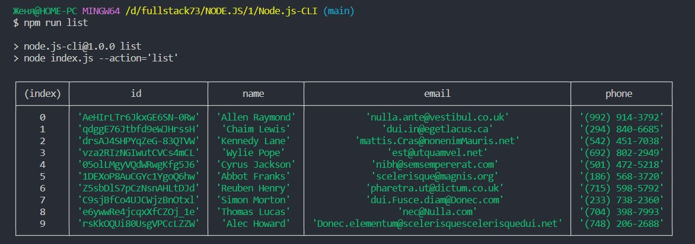
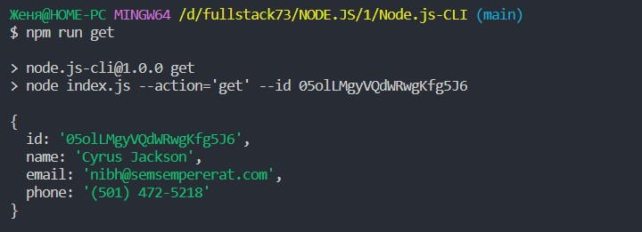
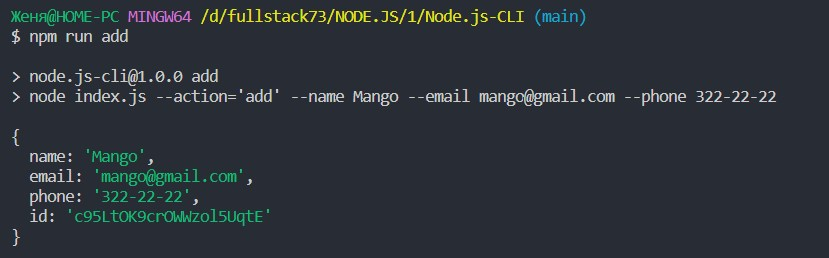
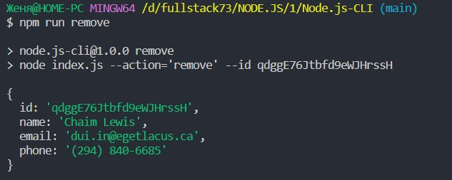

# Cкріншоти результату виконання кожної команди

### 1) Отримуємо і виводимо весь список контактів у вигляді таблиці (console.table)
node index.js --action="list"

https://monosnap.com/file/M0QPrk79pDZ88JwUfM7ReASOz2fGnG

### 2) Отримуємо контакт по id і виводимо у консоль об'єкт контакту або null, якщо контакту з таким id не існує.
node index.js --action="get" --id 05olLMgyVQdWRwgKfg5J6

https://monosnap.com/file/uIhDBRkATlrJw5w207Kn8CTfo1l5of

### 3) Додаємо контакт та виводимо в консоль об'єкт новоствореного контакту
node index.js --action="add" --name Mango --email mango@gmail.com --phone 322-22-22

https://monosnap.com/file/rIyBQwuStkWMsi6w45dCxKt8QQFR2j

### 4) Видаляємо контакт та виводимо в консоль об'єкт видаленого контакту або null, якщо контакту з таким id не існує.
node index.js --action="remove" --id qdggE76Jtbfd9eWJHrssH

https://monosnap.com/file/xgLN3kZFmgd2gqQxBK6FVd3LQTisAY

